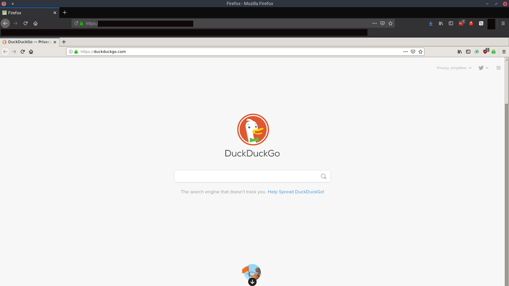

# IsoTor

***Deprecated:*** I have abandoned this project and decided to help maintain another similar one at [DomiStyle/docker-tor-browser](https://github.com/DomiStyle/docker-tor-browser).

This project is not working yet. I'm still trying to successfully get torbrowser-launcher to work correctly during the verification step.

## Remote Tor browser

This container runs a web server that serves an actual Tor browser when you navigate to it. Under the hood, the container is running xRDP over Apache Guacamole to serve up the Tor browser window. The X session is locked into the Tor browser and will respawn the Tor browser if the window is closed.

This is a fork of my older project [foxception](https://github.com/lawndoc/foxception) that was originally inspired by [this blog post](http://ivo2u.nl/Yo) by Ivo Woltring.

## Running the Service

This image is published on Docker Hub, but you'll still need to pull the seccomp filter from this repo. To run the container as recommended, use the below commands:

`$ wget https://raw.githubusercontent.com/lawndoc/IsoTor/main/IsoTor_seccomp.json`

`$ sudo docker run -d --shm-size=2G -p 8080:8080 --security-opt seccomp=IsoTor_seccomp.json --name IsoTor lawndoc/isotor:latest`

It is important to include all of the run flags. I recommend you read up on all of the flags being used and what they mean.

## Securing the Service

This project is continuously evaluated for security vulnerabilities, but it also includes an added mitigation for zero-day exploitation. A seccomp whitelist filter is used that restricts the syscalls that the container can make to only what it needs to function. Even if exploitation should happen, the seccomp filter will greatly restrict what the container can do. This may prevent impact or even exploitation altogether depending on the situation.

The seccomp filter was made with [this tool](https://github.com/lawndoc/oci-seccomp-bpf-hook) which logs all syscalls made to the kernel and then generates a seccomp filter when you stop the container. The provided filter allows only the syscalls required for starting the service and doing normal web browsing.

Depending on your setup, this browser may be exposed to the internet. Therefore, make sure you know where it is accessible from and control access with firewalls, htpasswd, etc... The seccomp filter *will not* prevent others from using and interacting with your IsoTor instance if they can get to it.

Also, keep in mind that if you fork this project for private use and modify the container too much it may require additional syscalls that are not whitelisted by the provided seccomp filter. In that scenario, you can use the tool mentioned above to generate a new filter.

## Sponsoring the Project

If you find IsoTor useful or depend on it for anonymous, unrestricted access to the internet, please consider becoming a sponsor so I can have the means and motivation to continue to actively maintain this project.
